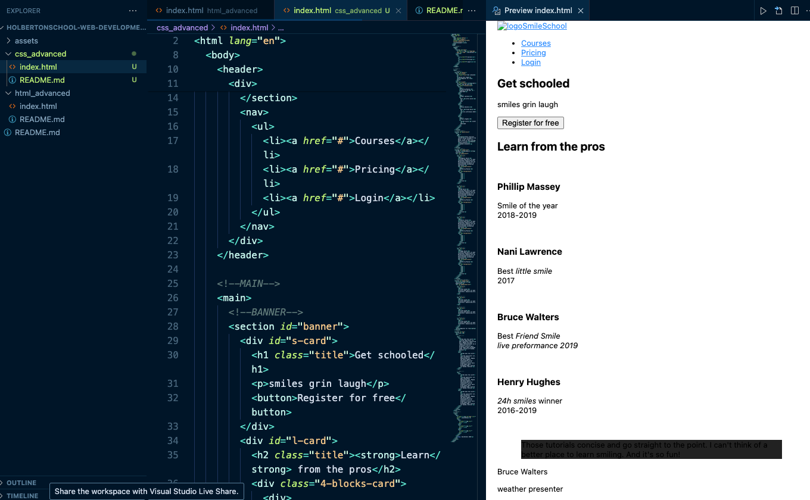

# Advanced CSS
CSS and style of the page

## General
    
    What is CSS
    How to add style to an element
    What is a class
    What is a selector
    How to compute CSS Specificity Value
    What are Box properties in CSS
    How does the browser load a webpage

## Design
#### from wireframe

#### to html

#### to highfidelity css structure

